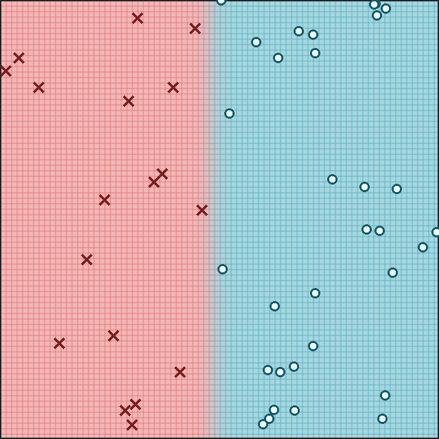
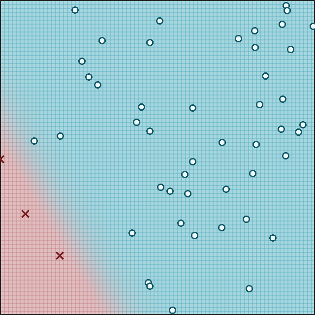
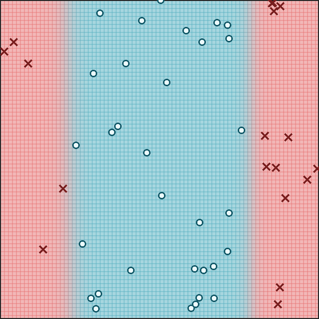
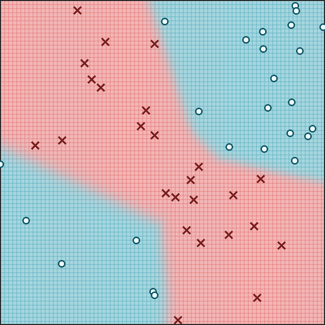

# minitorch
The full minitorch student suite. 


To access the autograder: 

* Module 0: https://classroom.github.com/a/qDYKZff9
* Module 1: https://classroom.github.com/a/6TiImUiy
* Module 2: https://classroom.github.com/a/0ZHJeTA0
* Module 3: https://classroom.github.com/a/U5CMJec1
* Module 4: https://classroom.github.com/a/04QA6HZK
* Quizzes: https://classroom.github.com/a/bGcGc12k

## Task 1.5: Scalar Training

All experiments were run with 50 points using `project/run_scalar.py`.

| Dataset | Hidden | Rate | Epochs | Seed | Final loss | Correct |
| --- | ---: | ---: | ---: | ---: | ---: | ---: |
| Simple | 2 | 0.5 | 500 | 3 | 0.739092568350 | 50/50 |
| Diag | 2 | 0.5 | 500 | 0 | 1.077378405227 | 50/50 |
| Split | 6 | 0.5 | 500 | 3 | 0.847184332902 | 50/50 |
| Xor | 20 | 0.5 | 1000 | 0 | 0.355248102416 | 50/50 |

### Simple

```text
Config: DATASET=Simple, PTS=50, HIDDEN=2, RATE=0.5, EPOCHS=500, SEED=3
Epoch 100: loss=6.087855, correct=47/50
Epoch 200: loss=3.662818, correct=48/50
Epoch 300: loss=2.094684, correct=50/50
Epoch 400: loss=1.097573, correct=50/50
Epoch 500: loss=0.739093, correct=50/50
```



### Diag

```text
Config: DATASET=Diag, PTS=50, HIDDEN=2, RATE=0.5, EPOCHS=500, SEED=0
Epoch 100: loss=11.312718, correct=47/50
Epoch 200: loss=9.931575, correct=47/50
Epoch 300: loss=3.616286, correct=47/50
Epoch 400: loss=1.795959, correct=50/50
Epoch 500: loss=1.077378, correct=50/50
```



### Split

```text
Config: DATASET=Split, PTS=50, HIDDEN=6, RATE=0.5, EPOCHS=500, SEED=3
Epoch 100: loss=21.391307, correct=39/50
Epoch 200: loss=8.228848, correct=48/50
Epoch 300: loss=1.974261, correct=50/50
Epoch 400: loss=1.189961, correct=50/50
Epoch 500: loss=0.847184, correct=50/50
```



### Xor

```text
Config: DATASET=Xor, PTS=50, HIDDEN=20, RATE=0.5, EPOCHS=1000, SEED=0
Epoch 100: loss=15.708030, correct=43/50
Epoch 200: loss=8.922263, correct=46/50
Epoch 300: loss=6.402280, correct=47/50
Epoch 400: loss=3.902842, correct=50/50
Epoch 500: loss=3.481128, correct=50/50
Epoch 600: loss=1.194251, correct=50/50
Epoch 700: loss=0.802957, correct=50/50
Epoch 800: loss=0.583231, correct=50/50
Epoch 900: loss=0.447497, correct=50/50
Epoch 1000: loss=0.355248, correct=50/50
```



## Task 2.5: Tensor Training

The tensor model uses three linear layers: `2 -> Hidden -> Hidden -> 1`, with
ReLU activations after the first two layers and a sigmoid output. All experiments
used 50 points and the `SimpleBackend`. Time per epoch is the average reported by
`project/run_tensor.py` over the complete training run.

| Dataset | Hidden | Rate | Epochs | Seed | Final loss | Correct | Time/epoch |
| --- | ---: | ---: | ---: | ---: | ---: | ---: | ---: |
| Simple | 2 | 0.5 | 500 | 3 | 0.739092568350 | 50/50 | 0.015080 s |
| Diag | 2 | 0.5 | 500 | 0 | 1.077378405227 | 50/50 | 0.015444 s |
| Split | 6 | 0.5 | 500 | 3 | 0.847184332902 | 50/50 | 0.058430 s |
| Xor | 20 | 0.5 | 500 | 0 | 3.481128282652 | 50/50 | 0.440592 s |

### Tensor training logs

```text
Config: DATASET=Simple, PTS=50, HIDDEN=2, RATE=0.5, EPOCHS=500, SEED=3
Epoch 100: loss=6.087855, correct=47/50
Epoch 200: loss=3.662818, correct=48/50
Epoch 300: loss=2.094684, correct=50/50
Epoch 400: loss=1.097573, correct=50/50
Epoch 500: loss=0.739093, correct=50/50
Average time per epoch: 0.015080s

Config: DATASET=Diag, PTS=50, HIDDEN=2, RATE=0.5, EPOCHS=500, SEED=0
Epoch 100: loss=11.312718, correct=47/50
Epoch 200: loss=9.931575, correct=47/50
Epoch 300: loss=3.616286, correct=47/50
Epoch 400: loss=1.795959, correct=50/50
Epoch 500: loss=1.077378, correct=50/50
Average time per epoch: 0.015444s

Config: DATASET=Split, PTS=50, HIDDEN=6, RATE=0.5, EPOCHS=500, SEED=3
Epoch 100: loss=21.391307, correct=39/50
Epoch 200: loss=8.228848, correct=48/50
Epoch 300: loss=1.974261, correct=50/50
Epoch 400: loss=1.189961, correct=50/50
Epoch 500: loss=0.847184, correct=50/50
Average time per epoch: 0.058430s

Config: DATASET=Xor, PTS=50, HIDDEN=20, RATE=0.5, EPOCHS=500, SEED=0
Epoch 100: loss=15.708030, correct=43/50
Epoch 200: loss=8.922263, correct=46/50
Epoch 300: loss=6.402280, correct=47/50
Epoch 400: loss=3.902842, correct=50/50
Epoch 500: loss=3.481128, correct=50/50
Average time per epoch: 0.440592s
```
